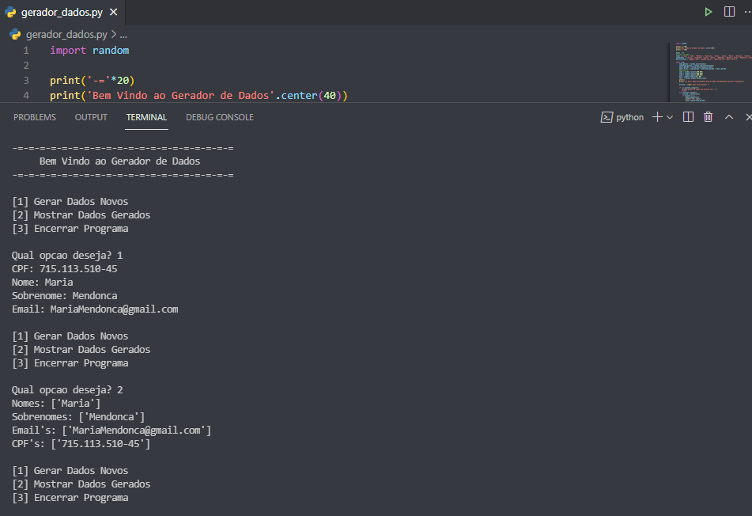

# Gerador de Dados
> Meu programa é capaz de gerar Dados falsos, contendo Nomes, Sobrenomes, Email's e CPF's. 

[![Build Status][travis-image]][travis-url]

Este programa pega dados de uma lista limitada e sortea-os aleatoriamente, assim formando nomes e sobrenomes, e com isso formando os emails, ja os CPF's uma pequena função que gera CPF's aleatorios.



## Usage example

Para usar este programa, basta rodar o python em sua maquina e selecionar uma das opcoes disponiveis.

## Development setup

Para rodar o programa, basta instalar pythob em sua maquina e usar o interpreter de sua preferencia e abrindo o local aonde o arquivo foi salvo.
*Aqui usamos como exemplo que o arquivo foi salvo como "Gerador_dados"*

```sh
python Gerador_dados.py
```

## Release History

* 2.0
    * Mudanca: codigo clean e simplificado
* 1.1
    * Primeiro Arquivo
* 1.0
    * Work in progress

## Meta

Joao Assalim – [@Assalim18869971](https://twitter.com/@Assalim18869971) – assalim.py@gmail.com

Distributed under the XYZ license. See ``LICENSE`` for more information.

[https://github.com/JoaoAssalim](https://github.com/JoaoAssalim)

## Contributing

1. Fork it (<https://github.com/JoaoAssalim/Gerador-de-Dados>)

<!-- Markdown link & img dfn's -->
[travis-image]: https://img.shields.io/travis/dbader/node-datadog-metrics/master.svg?style=flat-square
[travis-url]: https://travis-ci.org/dbader/node-datadog-metrics
